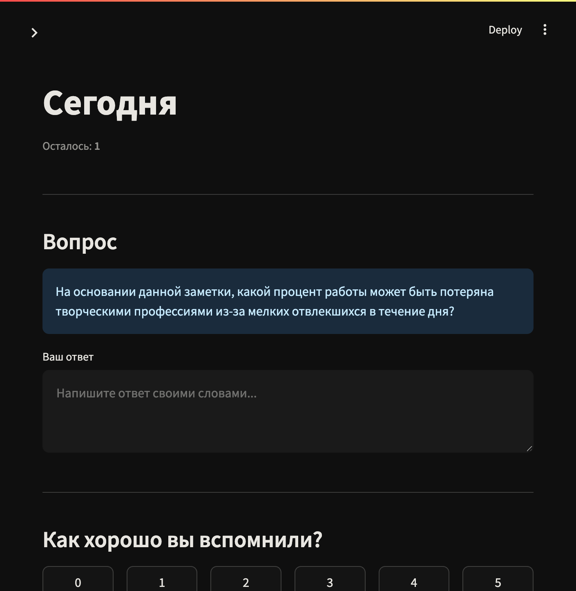
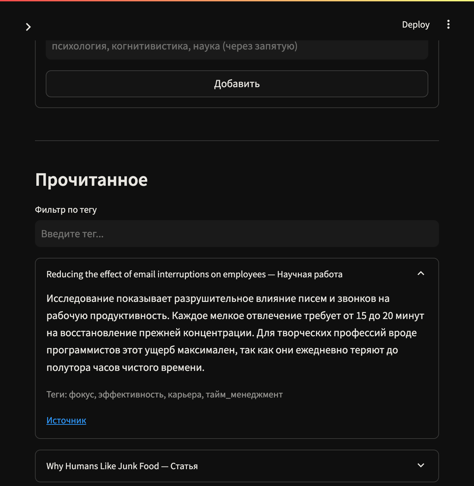
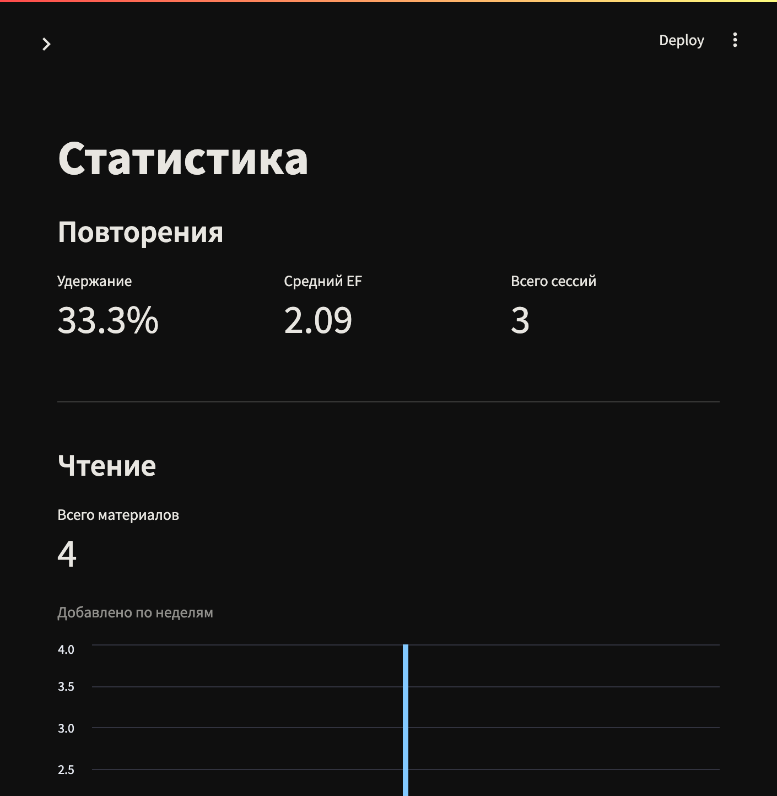
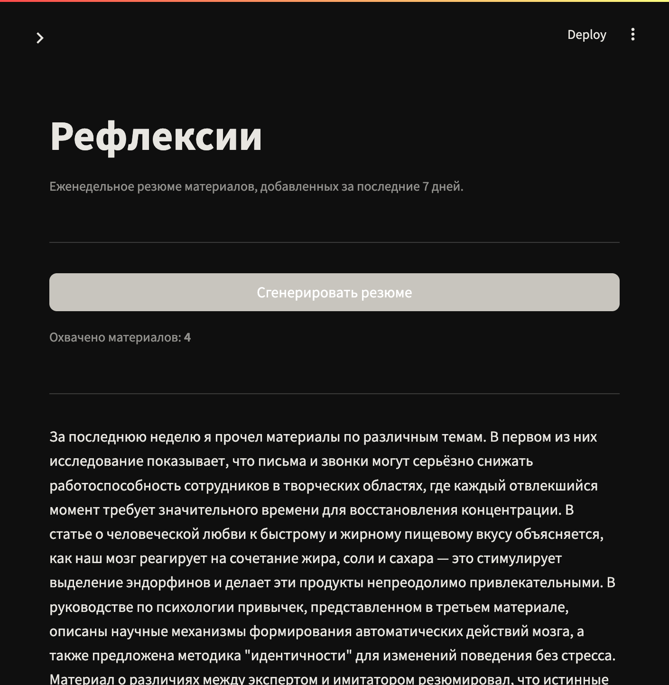

# SpacedReader

Персональное приложение интервального повторения для прочитанного. Пользователь логирует материал с краткой заметкой; приложение планирует повторения по алгоритму SM-2; при повторении LLM генерирует вопрос по заметке; пользователь отвечает, выставляет оценку 0–5, SM-2 пересчитывает расписание. Еженедельные LLM-резюме.

## Скриншоты

| Сегодня | Журнал |
|---|---|
|  |  |

| Статистика | Рефлексии |
|---|---|
|  |  |

## Архитектура

```
src/
├── domain/                # чистая доменная логика, без фреймворков
│   ├── reading/           # bounded context: материалы
│   ├── review/            # bounded context: карточки SM-2
│   ├── llm/               # абстракция LLM-клиента
│   ├── pagination.py      # Pagination VO
│   ├── datetime_provider.py
│   ├── transaction.py     # ITransactionContext — граница транзакции
│   └── exceptions.py      # базовый DomainException
├── use_cases/             # application layer, по одному файлу на use case
│   ├── reading/
│   ├── review/
│   └── insights/
├── infrastructure/
│   ├── database/
│   │   ├── models/        # SQLAlchemy-модели с from_domain / to_domain
│   │   ├── dao/           # реализации DAO, наследуют BaseDAO
│   │   ├── session_context.py  # ContextVar для per-request сессии
│   │   └── transaction.py
│   ├── llm/               # OpenAI-совместимый клиент и фейк для тестов
│   └── datetime_provider.py
├── presentation/
│   └── api/v1/            # FastAPI-роуты и Pydantic-схемы с from_domain
├── settings/              # pydantic-settings по контексту
├── container.py           # punq DI-контейнер
└── main.py

streamlit_app/             # фронтенд, общается с бэкендом только через HTTP
├── .streamlit/
│   └── config.toml        # тема
├── src/
│   ├── components/        # переиспользуемые UI-элементы (cards, charts)
│   ├── core/config.py     # BACKEND_URL, REQUEST_TIMEOUT
│   └── services/api_client.py
├── pages/
└── app.py
```

**Стек:** FastAPI · SQLAlchemy async · asyncpg · Alembic · punq · Ollama / OpenAI · Streamlit · Postgres · Docker Compose

**Принципы:** DDD, SOLID, абсолютные импорты, типизированные сигнатуры, `ITransactionContext` на use case уровне, domain exception pattern, `.new()` на командах, `from_domain` / `to_domain` на моделях и схемах, router-level try/except.

## Запуск

```bash
cp .env.example .env
docker compose up --build
```

- Бэкенд: http://localhost:8000
- Swagger: http://localhost:8000/docs
- Фронтенд: http://localhost:8501

Alembic-миграции запускаются автоматически при старте бэкенда.  
Ollama скачивает модель автоматически при первом запуске (модель задаётся через `OLLAMA_MODEL`).

## LLM

По умолчанию используется локальная модель через Ollama. Чтобы переключиться на OpenAI — заменить в `.env`:

```env
OPENAI_BASE_URL=        # убрать, чтобы использовать api.openai.com
OPENAI_API_KEY=sk-...
OPENAI_MODEL=gpt-4o-mini
```

## Тесты

```bash
# юнит-тесты (без БД)
pytest tests/unit -v

# интеграционные тесты (требуют Docker для testcontainers)
pytest tests/integration -v
```

## Переменные окружения

| Переменная | Описание | По умолчанию |
|---|---|---|
| `POSTGRES_HOST` | хост БД | `db` |
| `POSTGRES_PORT` | порт БД | `5432` |
| `POSTGRES_DB` | имя БД | `spacedreader` |
| `POSTGRES_USER` | пользователь | `spacedreader` |
| `POSTGRES_PASSWORD` | пароль | `spacedreader` |
| `OPENAI_API_KEY` | ключ API | `ollama` |
| `OPENAI_BASE_URL` | базовый URL LLM | `http://ollama:11434/v1` |
| `OPENAI_MODEL` | модель для LLM-вызовов | `qwen2.5:3b` |
| `OPENAI_TIMEOUT_SECONDS` | таймаут запросов | `30.0` |
| `OLLAMA_MODEL` | модель для автозагрузки в контейнер | `qwen2.5:3b` |
| `APP_BACKEND_URL` | URL бэкенда для фронтенда | `http://backend:8000` |
